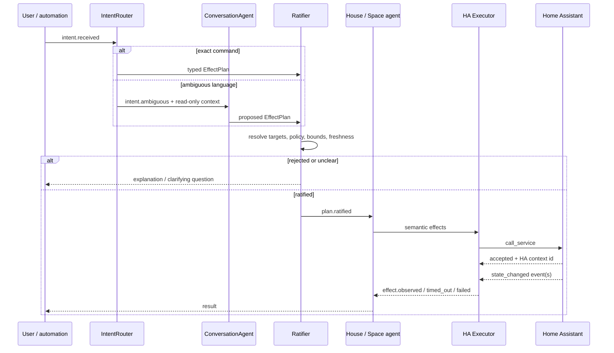

# Dobby — Jido Architecture

**Draft v0.4 — August 2026**  
**Status:** design for review; supersedes the Hermes runtime sections of
`dobby-design-original.md`, but preserves its household, hardware, trust, and
availability decisions unless this document says otherwise.

## 1. Position

Dobby should be a Phoenix application whose domain runtime is Jido. Home
Assistant remains the authority for device protocols, entity state, recorder
history, physical automations, and the final service-call boundary. Dobby owns
household intent, semantic device capabilities, ambient policies,
cross-device coordination, conversation, and the evidence showing why the
house did something.

The architecture is not “one Jido agent per Home Assistant entity.” Most HA
entities are data and effect endpoints; turning each bulb or sensor into an
agent would duplicate HA's state model and create a reconciliation problem.
The useful agent boundary is a behavior owner: a room, a climate zone, house
presence, media coordination, or a long-running workflow. A device gets its own
agent only when it has meaningful behavior or temporal state that HA does not
already own.

The LLM is a compiler from ambiguous human language into a small, typed effect
language. It cannot call Home Assistant, name HA services, or address raw entity
IDs. Deterministic code resolves targets, checks policy, compiles effects to HA
calls, observes the resulting state changes, and records the outcome.

## 2. What changes from the original design

The original principles survive, with a sharper boundary:

- Hermes disappears. Phoenix, Jido, Jido AI, and Postgres form one Dobby
  application and one supervision tree.
- HA's MCP server is no longer the primary control path. Dobby uses HA's native
  WebSocket and REST APIs behind a typed adapter. MCP is useful for generic
  external assistants; it is unnecessary indirection inside an Elixir system
  whose device vocabulary we control.
- “Agent amnesia” becomes rebuildable agent state. Durable preferences,
  policies, conversations, and execution records live in Postgres. HA remains
  the source of observed device state. Agent processes can be reconstructed
  from those two sources after a crash.
- The invocation log becomes a causal execution record: input signal → parsed
  intent → proposed plan → ratification → HA command → observed outcome.
- The LLM is off the normal event path. HA events never wake it by default.

The convenience scope remains: lights, media, climate, notifications, presence,
camera events, and camera snapshots. Locks, alarms, access control, and other
security-critical effects remain absent from Dobby's capability catalog.

## 3. Authority boundaries

Every piece of mutable state needs one owner.

| Concern | Authority | Dobby's copy |
|---|---|---|
| Physical entity state | Home Assistant | Rebuildable ETS projection |
| Protocols and device credentials | Home Assistant | None |
| Device/area inventory | Home Assistant | Cached semantic catalog |
| Safety and must-run automations | Home Assistant | Read-only visibility |
| Static actuation schedules | Home Assistant | Read model and authoring metadata |
| Ambient policies and household modes | Dobby/Postgres | Agent working state |
| Preferences and aliases | Dobby/Postgres | Agent working state |
| Conversations | Dobby/Postgres | Active Jido thread projection |
| Plans, commands, and outcomes | Dobby/Postgres | LiveView projection |
| Raw long-term device history | HA recorder | Queried on demand |

Each controllable entity also has an automation owner: `:ha`, `:dobby`,
`:vendor`, or `:manual`. Dobby does not run an ambient policy against an entity
that an overlapping HA or vendor automation controls. This avoids the usual
smart-home experience where two correct automations spend the evening arguing.

## 4. Two related trees

Jido's parent-child hierarchy is a logical coordination hierarchy. The current
Jido runtime starts agent processes under its instance-scoped AgentSupervisor;
it does not create a literal nested OTP supervisor for every domain parent.
Dobby therefore has two related views of the system.

### 4.1 OTP process tree

```text
Dobby.Application
├── Dobby.Repo
├── Dobby.PubSub
├── DobbyWeb.Endpoint
├── Dobby.Jido                         instance-scoped Jido runtime
│   ├── Registry
│   ├── TaskSupervisor
│   ├── AgentSupervisor
│   └── Scheduler
├── Dobby.HomeAssistant.Supervisor
│   ├── WebSocketClient                auth, reconnect, subscriptions
│   ├── CatalogSync                    states, services, areas, devices
│   └── StateMirror                    rebuildable ETS projection
├── Dobby.SignalBus                    normalized domain signals
├── Dobby.AgentBootstrap               starts durable logical agents
├── Dobby.ExecutionSupervisor          HA commands and observation waits
└── Dobby.Telemetry                    metrics, traces, durable audit sink
```

### 4.2 Jido domain hierarchy

```text
HouseCoordinator (Direct; deterministic control root)
├── SpaceAgent: kitchen
├── SpaceAgent: family_room
├── SpaceAgent: primary_bedroom
├── PresenceAgent
├── StewardAgent
├── ConversationAgent: <session>       dynamic; LLM only when needed
├── PolicyAuthorAgent: <session>       dynamic; durable-rule authoring
└── WorkflowAgent: <execution>         dynamic; bounded lifetime
```

The HouseCoordinator is not an LLM. A slow model request must not serialize
house events or become a dependency of deterministic behavior. Model use is
confined to ConversationAgent, PolicyAuthorAgent, and optional background calls
from StewardAgent. There is one design and prompt per agent role, but one process
per active session or invocation. Jido AI agents process requests serially and
expose policies for concurrent requests; a global singleton would turn two
simultaneous voice requests into needless contention.

## 5. Agent taxonomy

### HouseCoordinator

The deterministic coordinator and owner of house-wide modes such as `home`,
`away`, `sleep`, `guest`, and `vacation`. It routes cross-area goals, applies
house policy, starts bounded workflow agents, and aggregates outcomes. It uses
Jido's Direct strategy unless a concrete state machine emerges.

### SpaceAgent

One durable agent per behaviorally meaningful area, not necessarily every HA
area. It owns the area's desired ambient mode, manual-override lease, and the
coordination of lighting, media, and climate capabilities in that space.

Capability behavior is packaged as Jido plugins or ordinary domain modules and
reused across SpaceAgents. The agent does not hold authoritative device state;
it reads the current projection and records only policy-relevant working state.

### PresenceAgent

Owns the derived occupancy model for people, rooms, and house mode. Inputs are
HA person/device trackers, motion, door events, and explicit household
instructions. Outputs are typed presence signals, never direct device calls.

### StewardAgent

The Dobby-checks-the-house loop. Jido cron wakes it for bounded, named checks:
stale integrations, unusual energy use, contradictory policy state, weather
preparation, and digest composition. Most checks are deterministic. It invokes
an LLM only when interpreting an anomaly or composing a human-facing report
would materially help.

### ConversationAgent

The language lane. It receives only intents the deterministic command parser
cannot resolve. On the interactive path, Dobby assembles a compact, read-only
`HouseContext` from ETS before the model call: relevant spaces, capabilities,
aliases, preferences, current state, and recent conversation context. The agent
then makes one structured-output request and returns an `EffectPlan` or a
clarifying question. It does not enter a ReAct/tool loop to rediscover context
the application already has.

It has no HA client, raw service-call tool, `execute_plan` tool, or device
credential. Jido supports effectful LLM tools, but Dobby deliberately does not
expose them.

### PolicyAuthorAgent

A dynamic, bounded LLM agent for requests such as “when the last person leaves,
turn off the downstairs lights.” It emits a typed `PolicyDraft`; deterministic
code resolves its triggers, conditions, targets, effects, ownership conflicts,
and quiet-hour implications before anything is persisted or enabled. Policy
authoring is separate from immediate intent compilation because its output is
durable and deserves a different schema, prompt, model budget, and audit trail.

### WorkflowAgent

A bounded process for work with a lifecycle: apply a multi-room scene, make an
announcement and restore media, handle a delivery event, or reconcile a plan
whose effects complete asynchronously. It records per-effect outcomes and
stops when completed or failed.

### DeviceAgent

Exceptional. A device earns an agent when it owns a real state machine beyond
HA's entity state: a thermostat hold with expiry and recovery, a complex media
session, or a flaky endpoint needing bounded reconciliation. A light, binary
sensor, camera snapshot endpoint, or WiFi-presence entity normally remains a
typed capability binding.

### Strategy selection

Direct is the default strategy for HouseCoordinator, SpaceAgent, PresenceAgent,
and most device behavior. The FSM strategy belongs where the domain has named,
guarded phases across commands: `idle → announcing → restoring → completed`, or
`scheduled → holding → expiring → restored`. A light being `on` or a person
being `home` is observed domain state, not an FSM workflow phase. Modeling it as
one would duplicate HA and make external changes look like illegal transitions.
ConversationAgent and PolicyAuthorAgent use one-shot Jido AI structured output,
not an autonomous tool-using strategy.

## 6. Semantic device model

Dobby needs a stable vocabulary above HA's vendor-shaped entities.

- `Site` — one autonomous house and HA instance.
- `Space` — a behaviorally meaningful area or zone.
- `EntityRef` — a stable reference to an HA entity plus catalog metadata.
- `Capability` — semantic operations such as lighting, climate, media,
  announcement, occupancy, camera observation, or endpoint health.
- `Binding` — deterministic translation from one capability operation to one
  or more HA service calls and expected observations.
- `Target` — a semantic selector such as a space, named device, media zone, or
  household audience.
- `Policy` — a durable rule governing when effects may be proposed or applied.
- `Effect` — a desired semantic change, independent of HA service names.
- `Plan` — an ordered or parallel group of effects with provenance and
  execution semantics.

Illustrative effect shape:

```elixir
%Dobby.Effect{
  capability: :lighting,
  operation: :set,
  target: %Dobby.Target{space: :family_room},
  params: %{
    power: :on,
    brightness_pct: 35,
    color_temperature: :warm
  },
  preconditions: [],
  expires_at: nil
}
```

The LLM may produce that vocabulary. It may not produce this:

```elixir
%{domain: "light", service: "turn_on", entity_id: "light.foo", data: %{...}}
```

The latter is an adapter concern and changes as HA integrations change.

### 6.1 Default representation by endpoint type

| Endpoint | Default Dobby representation | When it earns an agent |
|---|---|---|
| Light, switch, outlet | `EntityRef` + lighting/power Binding | Almost never; HA already owns its state |
| Temperature, motion, leak sensor | Read-only EntityRef producing filtered Signals | Never unless it becomes a standalone diagnostic workflow |
| Sonos player/zone | Media Binding attached to a SpaceAgent | A bounded WorkflowAgent for announce/pause/restore coordination |
| Thermostat | Climate Binding attached to a SpaceAgent | Holds, expiry, recovery, or competing schedule ownership need an FSM |
| Camera/doorbell | Observation Binding + event Signals | A bounded delivery/event WorkflowAgent, not a permanent camera process |
| WiFi endpoint | Endpoint-health Binding | Persistent health/recovery policy with backoff and escalation |
| Person/device tracker | Input to PresenceAgent | PresenceAgent owns the derived model; trackers do not each become agents |

These are defaults, not a class hierarchy. Behavior promotes an endpoint into
an agent; its vendor category does not.

## 7. Intent and execution flow



`call_service` success means HA accepted a command; it does not prove that the
device reached the desired state. Dobby reports an effect as complete only when
the expected HA event is observed or a capability-specific readback confirms
it. The HA context ID returned by the WebSocket API is carried through the
execution record and correlated with subsequent events when possible.

For voice, Dobby may acknowledge with “Okay” after ratification and HA
acceptance, then observe completion asynchronously. It must not say “done” until
the effect is observed. A timeout or failure produces a brief follow-up instead
of making the user wait in silence for every device readback.

The deterministic fast path should initially cover a deliberately small set of
common command forms: on/off, absolute brightness, absolute temperature,
play/pause, absolute volume, announcements, and direct state questions. Misses
go to the LLM. The transcript corpus will tell us which additional forms deserve
deterministic handling; guessing a complete household grammar up front would be
a pleasant way to spend a month without improving the house.

### 7.1 Latency architecture and model routing

There is at most one LLM request between an ambiguous command and its first
effect. The HouseCoordinator is deterministic and never performs a second model
review. That second call would add latency without adding a safety boundary;
the Ratifier provides the safety boundary with code.

The three interactive paths are:

| Path | Model calls | Completion boundary |
|---|---:|---|
| Dashboard control or exact command | 0 | Ratify and dispatch immediately |
| Ambiguous command such as “make it cozy” | 1 | One schema-constrained `EffectPlan`, then ratify and dispatch |
| Standing-policy request | 1 | One schema-constrained `PolicyDraft`, then compile, validate, preview, and persist |

The model never selects a Jido process or HA entity directly. It selects semantic
targets and effects. The deterministic coordinator resolves those against the
live registry and catalog, starts any bounded workflows, and dispatches
independent effects concurrently.

Initial launch budgets, measured from receipt of a final text transcript:

- exact command: p95 under 100 ms to first HA dispatch;
- ambiguous command: p50 under 500 ms and p95 under 1.2 seconds to a ratified
  plan;
- voice: p95 under 2 seconds from final transcript to first visible actuation.

These are acceptance targets, not provider claims. Provider/network time,
schema validity, ratification rejection rate, and time-to-first-effect are
recorded separately. A model that misses the latency budget does not ship in the
interactive alias, however impressive its general benchmarks are.

Jido AI and ReqLLM support application-level model aliases. Dobby should define
aliases by workload rather than scatter provider IDs through agent modules:

| Alias | Workload | Initial candidate | Comparison set |
|---|---|---|---|
| `:intent_fast` | `EffectPlan` compilation | `openai:gpt-5.6-luna`, reasoning `none` | Gemini 3.5 Flash-Lite at minimal thinking; Claude Haiku 4.5 |
| `:policy_capable` | durable `PolicyDraft` authoring | `openai:gpt-5.6-terra`, reasoning `low` | Gemini 3.6 Flash; Claude Sonnet 5 |
| `:steward_capable` | anomaly interpretation and prose, off the hot path | same as `:policy_capable` initially | change only when the eval corpus shows a reason |

The initial mapping is a starting hypothesis. Before implementation locks it
in, run the same Dobby-specific corpus against all candidates and compare valid
schema rate, semantic exactness, clarification quality, ratifier rejection,
p50/p95 latency, and cost. Keep prompts small, cap output to the schema, disable
unneeded reasoning, and avoid tools on the command path. Provider portability
is useful here because household language, not a public leaderboard, determines
the winner.

## 8. Ratification boundary

`Dobby.Ratifier` is a pure, heavily tested module. It accepts an `EffectPlan`, a
fresh catalog snapshot, household policy, and request context. It either emits a
normalized `RatifiedPlan` or a typed rejection.

Checks include:

- Every capability and operation is in Dobby's closed vocabulary.
- Every target resolves to catalog entities currently allowed for Dobby.
- Security-critical entity domains and explicit denylisted entities cannot
  resolve, even if the model names them indirectly.
- Values obey capability bounds: temperature ranges, volume ceilings, supported
  light attributes, announcement quiet hours, and maximum fan-out.
- The plan is fresh enough to execute and its preconditions still hold.
- The entity's automation owner permits Dobby to act.
- Duplicate plan/effect IDs do not execute twice.
- A manual-override lease does not forbid the proposed ambient change.

The ratifier does not use an LLM. It does not decide whether “cozy” means 35%
brightness; interpretation happened above the boundary. It decides whether the
concrete proposal is valid and currently permissible.

There is no true transaction across household devices. Multi-effect plans are
best-effort with explicit per-effect outcomes. Dobby should not perform a
surprise rollback because one lamp was offline after music had already started.
It reports the partial result and allows deterministic retry where the effect is
idempotent.

## 9. Home Assistant bridge

`Dobby.HomeAssistant` is an application-owned adapter, not an agent tool bag.

### Inbound

- Maintain one authenticated connection to `/api/websocket`.
- On connect or reconnect, fetch current states, available services, and the
  catalog data needed to resolve areas/devices/entities.
- Subscribe to `state_changed` and selected high-value event/trigger streams.
- Update `StateMirror` for every relevant state change.
- Convert only behaviorally meaningful deltas into Jido Signals. A temperature
  sensor reporting the same rounded value should not wake an area agent.
- Use reconnect backoff and require a complete resync before declaring the HA
  bridge healthy.

The raw event stream does not fan into HouseCoordinator. It is filtered and
partitioned by site, space, and capability first. Jido AgentServers process
signals serially, so a single root mailbox is the wrong place for every sensor
tick in the house.

### Outbound

- Compile ratified effects to absolute HA service calls where possible. Prefer
  `set brightness to 35` over `increase brightness`; avoid `toggle` in any path
  that may retry.
- Attach execution provenance and retain HA's response context ID.
- Observe expected state changes with a capability-specific timeout.
- Reconcile uncertainty after reconnect rather than replaying stale commands.
- Fail fast while HA is unavailable. Do not queue household commands for blind
  execution minutes later.

### Voice

HA Assist requires a conversation entity inside HA. Dobby should ship a minimal
`dobby_conversation` custom integration implementing HA's `ConversationEntity`.
It forwards text, conversation ID, language, device/area context, and user
context to the local Phoenix API, then maps Dobby's result back to an HA
conversation response. This small Python adapter contains no policy or device
control.

## 10. Signals

Jido Signals are CloudEvents-compatible and provide the common envelope. Dobby
uses one naming and correlation convention from ingress through execution.

Examples:

```text
ha.entity.state.changed
ha.event.doorbell.detected
dobby.intent.received
dobby.intent.ambiguous
dobby.plan.proposed
dobby.plan.ratified
dobby.plan.rejected
dobby.effect.dispatched
dobby.effect.observed
dobby.effect.failed
dobby.policy.check.requested
dobby.policy.check.completed
```

For an HA event:

- `source`: `ha://<site-id>`
- `subject`: HA entity or device identifier
- `time`: HA `time_fired`
- `data`: normalized old/new state plus a bounded subset of attributes
- extensions: `site_id`, `ha_context_id`, `ha_parent_id`, `trace_id`

Jido's UUIDv7 remains the signal ID. HA context IDs are correlation metadata,
not replacement IDs. Raw vendor payloads remain attached only where needed for
diagnostics and are never passed unfiltered into an LLM prompt.

The in-memory signal bus is the live nervous system. Postgres holds durable
Dobby decisions and outcomes; HA Recorder holds raw historical state. Dobby
does not need to duplicate every HA `state_changed` event forever.

## 11. Scheduling and heartbeat

There are three kinds of time:

1. **Must-run device schedules.** “Floors on at 5:00 on weekdays” remains an HA
   automation. It must run when Dobby, the model provider, or the internet is
   down.
2. **Ambient policy evaluation.** A Dobby policy such as “when the house becomes
   empty, settle nonessential rooms” is durable in Postgres and evaluated by
   deterministic agents on signals or Jido cron ticks. Failure degrades comfort,
   not safety.
3. **Cognitive recurrences.** Morning briefs, anomaly summaries, and “check in
   on the house” use the StewardAgent and Jido cron. The model is invoked only
   if language or ambiguous judgment is part of the job.

Jido supports delayed Schedule directives and recurring Cron/CronCancel
directives. Dynamic cron registrations can be durable when the agent is managed
with storage; declarative schedules are recreated from code at process start.
Dobby's canonical policy definition still lives in Postgres so the runtime can
be rebuilt and the dashboard can explain what will happen.

The rule remains simple: if the value is the physical action happening on time,
HA owns it. If the value is Dobby waking up to observe, decide, or explain, Jido
owns it.

### 11.1 Standing-policy authoring

Household members may create, revise, disable, and inspect Dobby policies in
natural language. PolicyAuthorAgent compiles the request into Dobby's closed
policy DSL; it cannot emit Elixir, SQL, templates, raw signal routes, HA service
names, or entity IDs.

A `PolicyDraft` contains only:

- a typed trigger, such as a domain signal, state transition, or bounded cron;
- typed conditions over household mode, presence, time, current state, and
  manual-override status;
- semantic effects from the same closed vocabulary as `EffectPlan`;
- cooldown, expiry, priority, and enabled/draft status;
- a plain-language readback generated from the normalized policy, not trusted
  model prose.

`Dobby.PolicyCompiler` resolves names, rejects unknown or cyclic dependencies,
checks schedule and automation ownership conflicts, applies the same capability
bounds as the Ratifier, and stores an immutable policy version. An explicit
imperative to create or change a rule may enable it immediately; tentative or
ambiguous language remains a draft or prompts a question. Every write is
versioned, visible in the household dashboard, reversible, and exercised once
in dry-run form against the current house snapshot before activation.

## 12. Manual changes and competing intent

A house must not fight its occupants.

An HA state change whose context does not match an active Dobby execution is
treated as external intent. For Dobby-owned ambient behavior, that creates a
manual-override lease for the affected space/capability. The default lease ends
at the next explicit schedule boundary or after a configurable timeout. Direct
user commands to Dobby can replace the lease immediately.

This is necessarily an inference: physical controls, HA dashboards, vendor apps,
and HA automations do not always identify themselves uniformly. Dobby records
the evidence and treats unknown origin as manual rather than overriding it.

## 13. Persistence

Postgres tables should model Dobby's domain rather than serialize the entire
runtime:

- `sites`, `spaces`, `entity_bindings`, `aliases`
- `policies`, `policy_versions`, `manual_overrides`
- `conversations`, `messages`
- `intents`, `plans`, `effects`, `executions`
- `signal_events` for selected durable domain events
- `pairings`, `preferences`, `quiet_hours`

Agent process state is a cache of this durable data plus HA's observed state.
On boot, `AgentBootstrap` loads policies and catalog bindings, starts durable
agents with stable IDs, and then admits live signals after HA completes its
initial resync.

Jido provides ETS and file storage in core and the ecosystem has an early
`jido_ecto` adapter. The latter currently labels itself alpha and warns against
production reliance. Dobby should use ordinary, app-owned Ecto schemas first.
We can adopt a Jido storage adapter later if hibernate/thaw provides concrete
value; it should not dictate our initial data model.

## 14. Dashboard and observability

There are two dashboards with different jobs.

### Household surface

A custom Phoenix LiveView surface at `dobby.local`:

- chat and streaming replies
- spaces with observed state, desired mode, and manual overrides
- active schedules and Dobby policies, with an explicit owner label
- recent actions stated as “requested / accepted / observed,” not a vague
  success checkmark
- device and integration health
- pairing, preferences, quiet hours, and an emergency Dobby-disable switch

HA's own dashboard remains the detailed device-control surface.

### Operator surface

Phoenix LiveDashboard plus the beta `jido_live_dashboard` package can provide
agent discovery, live processes, telemetry traces, and signal/directive timing
during development. Dobby adds domain pages for plan ratification, effect
correlation, HA bridge health, queue depth, LLM cost/latency, and rejected plans.

Jido emits telemetry for agent commands, signals, directives, queues, strategies,
LLM calls, tools, tokens, and request lifecycle. Dobby attaches trace IDs at
intent ingress and carries them through every signal and DB record.

## 15. Failure behavior

| Failure | Required behavior |
|---|---|
| Dobby process/VM down | Physical controls and HA-owned automations continue |
| Model/provider down | Exact commands, dashboard, HA schedules, and deterministic policies continue; ambiguous language gets an honest error |
| HA down | Dobby shows stale/unavailable state and rejects actuation; no blind queue |
| HA WebSocket reconnect | Rebuild state projection before processing new policy effects |
| Agent crash | Restart from Postgres policy plus HA projection; do not trust old in-memory state |
| Duplicate signal or retry | Idempotency key prevents duplicate effect execution |
| Crash after service call | Reconcile observed state before deciding whether to retry |
| Manual device change | Manual override wins over ambient policy |
| Partial multi-device plan | Record each outcome and report partial completion; no automatic global rollback |
| Stale LLM plan | Ratifier rejects on version/precondition mismatch and requests a fresh plan |

## 16. Dependency posture

As of this draft, the current published line is Jido 2.3.x and Jido AI 2.3.x.
Core Jido, Jido Signal, Jido Action, Jido AI, and ReqLLM are marked stable by the
project; several surrounding packages are beta or experimental. The release
pace is fast, and Jido 2.3.3 included runtime race and persistence fixes.

Initial dependency policy:

- Pin Jido and Jido AI to the current minor line and commit `mix.lock`.
- Upgrade intentionally after running Dobby's integration and restart suite.
- Use `jido_live_dashboard` only for the operator surface; Dobby must not depend
  on it for runtime correctness.
- Do not adopt `jido_ecto`, `jido_cluster`, Jido Studio, or the broader package
  ecosystem until a vertical slice proves a need.
- Use ReqLLM through Jido AI rather than writing a provider client.
- Keep the Home Assistant adapter application-owned and narrow.

## 17. Network and multi-home topology

The original one-box layout still works: HAOS in one VM; Phoenix/Jido/Postgres in
the services VM; traffic between them on the host bridge. Clients reach Phoenix
on the LAN. Telegram uses outbound long polling. Voice traffic stays local from
HA to Phoenix. No inbound port forwarding is required.

Dobby does not form a direct network mesh with bulbs, speakers, cameras, or WiFi
endpoints. HA is that integration mesh. Dobby's “mesh” is the logical signal and
agent topology above it.

For a future beach house, run one autonomous HA + Dobby site per house. Exchange
typed site signals over Tailscale/HTTPS if cross-house coordination becomes
useful. Do not begin with distributed Erlang across a WAN; each house should
continue operating when the other house or the tunnel is unavailable.

## 18. Verification strategy

- Test Actions and Ratifier as pure functions with no processes or model calls.
- Property-test value bounds, target resolution, denylisting, duplicate effects,
  and stale-plan rejection.
- Run AgentServer tests for routing, queue behavior, crash recovery, and
  parent/child lifecycle.
- Provide a deterministic fake HA adapter that records commands and emits
  expected, delayed, missing, duplicate, and contradictory state changes.
- Add restart tests at every boundary: before dispatch, after HA acceptance,
  before observation, and after partial plan completion.
- Build an LLM eval corpus for intent-to-plan compilation. Code checks the plan;
  the model never gets credit merely for producing persuasive prose.
- Verify each supported capability against a real HA instance before marking it
  supported.
- Run one family acceptance flow in a real room before expanding the catalog.

## 19. Build order

### Slice 0 — Home Assistant substrate

Install HA, integrate one room's lights and Sonos, and verify physical controls,
HA state, and HA-owned automations. This still ships household value before AI.

### Slice 1 — Deterministic kernel

Create Phoenix/Postgres/Jido; build the fake HA adapter, signal conventions,
StateMirror, catalog, one SpaceAgent, Effect/Plan schemas, Ratifier, executor,
and causal trace UI. Demonstrate one exact command end to end with no LLM.

### Slice 2 — Real HA bridge

Connect the WebSocket client to the live HA instance. Prove reconnect/resync,
service-call correlation, manual override, device-unavailable behavior, and a
real light change in one room.

### Slice 3 — Ambiguous intent

Add Jido AI and the ConversationAgent. The proving phrase is “make the family
room cozy”: compile it to semantic lighting and media effects, ratify them,
execute them, observe outcomes, and show the entire trace. Add evaluation cases
before adding more device domains.

### Slice 4 — Ambient stewardship

Add PresenceAgent, StewardAgent, PolicyAuthorAgent, policy persistence,
heartbeats, quiet hours, and one cross-device policy such as the
last-person-out sweep.

### Slice 5 — Household interfaces

Add the household LiveView, Telegram pairing/channel, the HA conversation
adapter, voice pipeline, and Sonos announcements.

### Slice 6 — Capability expansion

Add climate, delivery/camera events, energy/history, health monitoring, and the
second house only as each capability earns its place.

## 20. Decisions and current recommendations

1. **Agent granularity.** Recommend behavior/space agents with exceptional
   device agents, not one agent per HA entity.
2. **Root topology.** Use a deterministic HouseCoordinator control root and
   dynamic ConversationAgent children; the LLM is the top of the language lane,
   not the house runtime.
3. **Schedule ownership.** Recommend HA for must-run physical schedules; Jido
   for observation, ambient policy evaluation, and cognitive recurrence.
4. **Manual override.** Recommend external/unknown device changes temporarily
   suspend Dobby ambient policy for that capability and space.
5. **First vertical slice.** Recommend one real room and the phrase “make it
   cozy,” after the same room works through the deterministic path.
6. **Policy authoring (ratified).** Natural language may author standing Dobby
   policies through PolicyAuthorAgent, the closed policy DSL, PolicyCompiler,
   immutable versions, and reversible activation. It cannot author arbitrary
   code or raw HA calls.

## Sources

- [Jido agents](https://jido.run/docs/concepts/agents)
- [Jido agent runtime](https://jido.run/docs/concepts/agent-runtime)
- [Jido strategies](https://jido.run/docs/concepts/strategy)
- [Jido signals](https://jido.run/docs/concepts/signals)
- [Jido directives and scheduling](https://jido.run/docs/concepts/directives)
- [Jido parent-child hierarchies](https://jido.run/docs/learn/parent-child-agent-hierarchies)
- [Jido AI agents with tools](https://jido.run/docs/learn/ai-agent-with-tools)
- [Jido AI structured output](https://jido-ai.hexdocs.pm/llm_facade_quickstart.html)
- [Jido ReqLLM and model aliases](https://jido.run/docs/reference/req-llm-and-llmdb)
- [Jido telemetry and observability](https://jido.run/docs/reference/telemetry-and-observability)
- [Jido 2.x changelog](https://github.com/agentjido/jido/blob/main/CHANGELOG.md)
- [Current Jido package release](https://hex.pm/packages/jido)
- [Current Jido AI package release](https://hex.pm/packages/jido_ai)
- [Jido Ecto status](https://github.com/agentjido/jido_ecto)
- [Jido LiveDashboard](https://github.com/agentjido/jido_live_dashboard)
- [Home Assistant WebSocket API](https://developers.home-assistant.io/docs/api/websocket/)
- [Home Assistant REST API](https://developers.home-assistant.io/docs/api/rest/)
- [Home Assistant ConversationEntity](https://developers.home-assistant.io/docs/core/entity/conversation/)
- [Home Assistant Assist pipelines](https://developers.home-assistant.io/docs/voice/pipelines/)
- [OpenAI GPT-5.6 model guidance](https://developers.openai.com/api/docs/guides/latest-model)
- [OpenAI GPT-5.6 Luna](https://developers.openai.com/api/docs/models/gpt-5.6-luna)
- [OpenAI GPT-5.6 Terra](https://developers.openai.com/api/docs/models/gpt-5.6-terra)
- [Google current Gemini Flash models](https://ai.google.dev/gemini-api/docs/latest-model)
- [Anthropic model selection](https://platform.claude.com/docs/en/about-claude/models/choosing-a-model)
